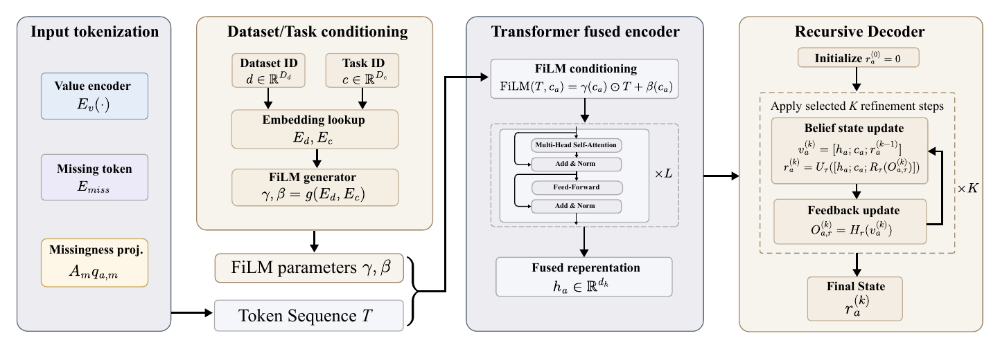

# MC-TRCM

**MC-TRCM: Observation-Aware Recursive Fusion for Incomplete Mobile and Wearable Mental-Health Feature Views**

Research code accompanying the [paper](main.pdf) by Wentao Wang, **Lifeng Han**, Zining Ren, Hengyu Zhong, and Guangyu Zou. Wentao Wang and Lifeng Han contributed equally and share first authorship; Guangyu Zou is the corresponding author.

MC-TRCM (Modality-Conditioned Temporal Recursive Context Model) keeps feature sources as separate tokens, models observed and absent sources, conditions fusion on dataset and task identity, and recursively refines predictions. The paper evaluates six severity and classification endpoints from DepreST-CAT and PSYCHE-D using participant-level splits and validation-only model selection.

This repository includes dataset parsers, model implementations, baseline runners, experiment orchestration, and protocol checks. Parsers for StudentLife, Depresjon, and OBF-Psychiatric are also retained as supporting benchmark utilities.

## Model architecture



Model architecture reproduced from Figure 2 of the [accompanying paper](main.pdf) (PDF page 6).

## Repository Layout

- `src/preprocess/`: dataset download, extraction, parsing, split generation, and leakage checks.
- `src/models/`: MC-TRCM, displayed tabular/neural baselines, data loaders, and training entry points.
- `src/evaluation/`: shared metrics, validation-selection helpers, and comparison utilities.
- `scripts/`: paper-level experiment orchestration, calibration, uncertainty, and table utilities.
- `configs/`: dataset, model, training, split, and protocol configuration files.
- `tests/`: protocol and model smoke tests.
- `reports/`: lightweight audit notes generated by preprocessing and split checks.

Raw datasets, participant-level intermediate tables, trained weights, prediction caches, and generated experiment outputs are not distributed in this repository. Obtain the data from its original source under its own license and prepare it locally. The included split audit reports aggregate counts from an earlier run; it does not replace local split manifests or provide regenerated paper results.

## Setup

Use Python 3.11 or later. Run commands from the repository root. For Windows PowerShell:

```powershell
python -m venv .venv
.\.venv\Scripts\Activate.ps1
python -m pip install -r requirements.txt
```

For Linux or macOS, activate with `source .venv/bin/activate`. The requirements cover MC-TRCM, core tabular/neural baselines, and Parquet data loading. Select a PyTorch build appropriate for your CPU or CUDA environment if needed.

Optional dependencies:

- `python -m pip install lightgbm xgboost interpret` enables the LightGBM, XGBoost, and Explainable Boosting Machine reference baselines. The standalone DepreST-CAT public-baseline wrapper also imports XGBoost directly.
- `python -m pip install pyreadr` enables StudentLife R-data parsing and is required for the all-dataset preprocessing commands below.

The dependency list is not a frozen environment from the paper experiments.

## Quick checks without datasets

```powershell
python -m unittest discover -s tests -v
python -m src.models.run_baselines --help
python -m src.models.train_mctrcm_v2 --help
python scripts/run_core_mctrcm_protocol.py --help
```

The ordinal-probability and ordered-threshold tests run without datasets. Split, standardization, and full model-forward tests skip when their prepared tables are absent. These checks do not rerun the paper experiments.

## Data preparation

Dataset sources and expected raw-data paths are listed in [configs/dataset_configs](configs/dataset_configs). Primary paper datasets are [DepreST-CAT](https://github.com/mltlachac/DepreST-CAT) and [PSYCHE-D](https://doi.org/10.5281/zenodo.5085146). Downloaded files belong under `data_raw/`; parsers write canonical tables under `data_interim/`.

For the existing all-dataset pipeline, first obtain all five configured datasets and install `pyreadr`:

```powershell
python -m src.preprocess.download_datasets --dataset all --skip-existing
python -m src.preprocess.extract_archives --dataset all --skip-existing
python -m src.preprocess.run_available_parsers
python -m src.preprocess.generate_splits
python -m src.preprocess.audit_temporal_leakage
```

These download helpers use the official URLs recorded in the configurations; availability and access are controlled by the dataset providers. Individual parsers can be run separately, for example `python -m src.preprocess.preprocess_deprest_cat`. The current `run_available_parsers` and `generate_splits` entry points expect all five datasets; `generate_splits` has no dataset-selection flag.

## Training and experiment orchestration

After canonical tables and participant-level split manifests have been prepared:

```powershell
python -m src.models.run_baselines --datasets deprest_cat psyche_d --models elastic_net mlp
python -m src.models.train_mctrcm_v2 --datasets deprest_cat psyche_d --model-config-path configs/model_configs/mctrcm_final.json
python scripts/run_core_mctrcm_protocol.py --stage smoke
```

The core protocol driver also provides `k_search`, `final`, `ablations`, `feature_sources`, `ensemble`, `summarize`, and `all` stages. Inspect `--help` before selecting datasets, seeds, recursion steps, or search profiles. Summaries require outputs from prior experiment stages:

```powershell
python scripts/run_core_mctrcm_protocol.py --stage summarize
```

Model configurations and orchestration scripts document the experimental settings. The [strict alignment protocol](configs/protocols/STRICT_ALIGNED_WITHIN_DATASET.json) requires shared participant splits, training-only preprocessing statistics, and validation-only selection and calibration. A single training command is an entry point, not a claim that every table in the paper has been reproduced.

## License and attribution

The code is distributed under the [MIT License](LICENSE). The paper retains its listed authorship. Dataset releases and external benchmark implementations retain their respective licenses and attribution.
